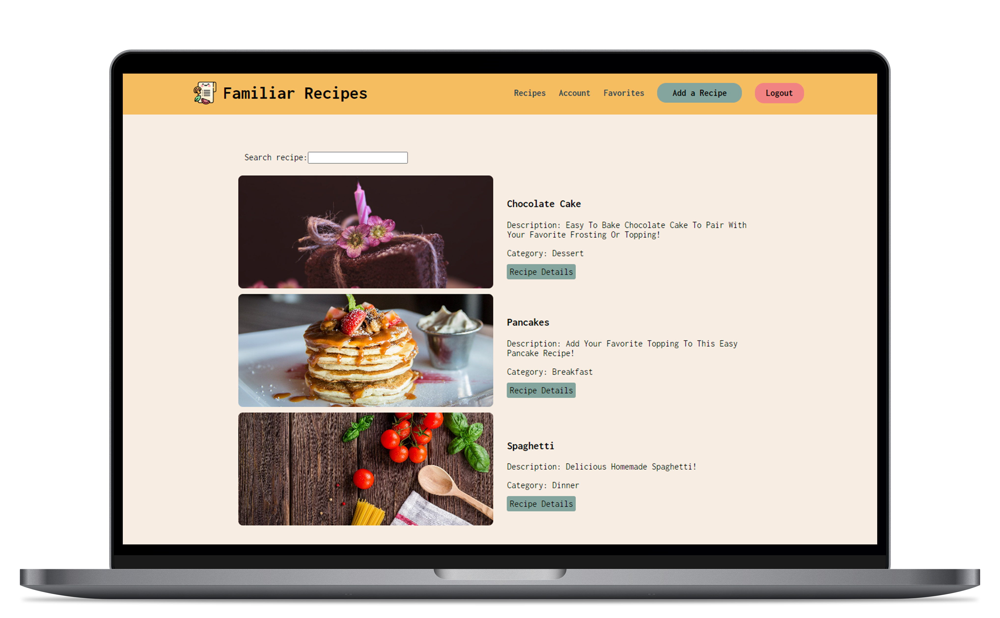
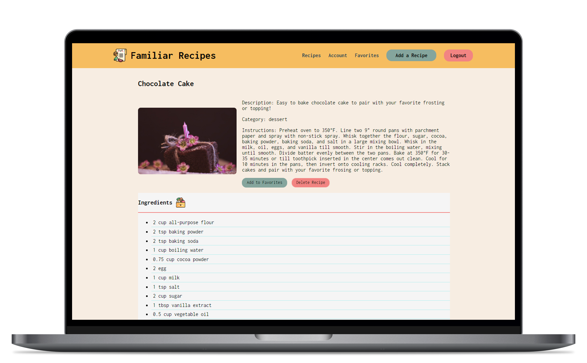

# Recipe site

Developed with PERN stack and deployed with Render.
Familiar recipes is a full stack project to keep track of your favorite recipes with a search functionality. Users can register/login to add new recipes and save to favorites.
The frontend was built using Javascript, HTML, CSS and React. State management was implemented with Redux for user information and session token handled with JWT. Navigation and Routing was implemented with React router and Express.js. Backend was built using Postgresql.

### Links

- Repository URL: [GitHub repo](https://github.com/ElizabethLankford/Recipe-project/)
- Live Site URL: [Live site URL here](https://familiar-recipes-app.onrender.com/)

### Built with

- JavaScript (Functionality)
- React (Componenets)
- React Router (Navigation)
- Redux (State management)
- JWT (Session token)
- CSS custom properties
- Postgres (database)
- Express.js (API routing)

## Author

- :octocat: GitHub - [Elizabeth Lankford](https://github.com/ElizabethLankford/)
- :woman_technologist: Portfolio - [Elizabeth Lankford](https://elizabeth-lankford.com/)
- :link: LinkedIn - [Elizabeth Lankford](https://www.linkedin.com/in/elizabethlankford/)
